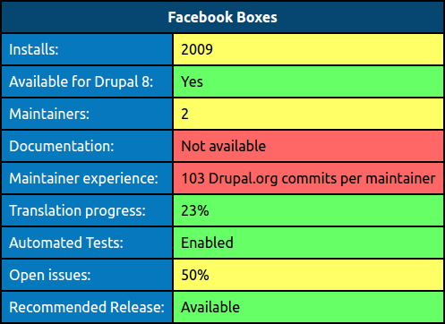

## Evaluating the Quality of Drupal Modules

    <h6>Applying data mining techniques to discover relationships between module metrics and popularity</h6>

    <h6>[ben-denham.github.io/drupal-meetup-module-popularity](https://ben-denham.github.io/drupal-meetup-module-popularity)</h6>

## Overview

* Background and motivation <!-- .element: class="fragment" -->
* Building a module dataset <!-- .element: class="fragment" -->
* "Cleaning" the data <!-- .element: class="fragment" -->
* Applying machine learning algorithms <!-- .element: class="fragment" -->
* Evaluating the results <!-- .element: class="fragment" -->
* Limitations <!-- .element: class="fragment" -->
* Implications for the community <!-- .element: class="fragment" -->
* Ideas for future research <!-- .element: class="fragment" -->

## Background and Motivation

* Core problem: Is this module of acceptable quality? <!-- .element: class="fragment" -->
* Important with the removal project applications <!-- .element: class="fragment" -->
* DA is looking for ways to indicate module quality: <!-- .element: class="fragment" -->
    * E.g. Module "stars" and automated source-code quality reports on
      project pages

## Background and Motivation

* Previous studies have applied data mining to identify attributes of
  popular software projects
* I would use this approach to find relationships between module
  popularity and: <!-- .element: class="fragment" -->
    * Source-code metrics <!-- .element: class="fragment" -->
    * Project metrics considered in practice by surveyed Drupal
      developers <!-- .element: class="fragment" -->

## Building a Module Dataset

* Scraping project pages with Python's BeautifulSoup <!-- .element: class="fragment" -->
* Running PDepend and PHPCodeSniffer to generate source-code metrics <!-- .element: class="fragment" -->
* Collected data for ~13,000 Drupal 7 modules over ~60 hours <!-- .element: class="fragment" -->

## Tips for Web-Scraping

* Check website rate limits <!-- .element: class="fragment" -->
* Ensure it won't crash overnight <!-- .element: class="fragment" -->
* Scrape some pages, correct bugs, repeat <!-- .element: class="fragment" -->
* Make it easy to pause/resume <!-- .element: class="fragment" -->
* LOG ALL THE THINGS! <!-- .element: class="fragment" -->

## "Cleaning" the Data

Argued to be the most important step for successful data mining <!-- .element: class="fragment" -->

* Accounting for and correcting missing values <!-- .element: class="fragment" -->
* Normalising source-code metrics to the size of the codebase <!-- .element: class="fragment" -->
* Removing young projects <!-- .element: class="fragment" -->
* Removing metrics directly-related to popularity <!-- .element: class="fragment" -->

## Classifying Modules

| Label | Total Installations | Modules |
| ----- | ------------------- | ------- |
| Unpopular | < 100 | 5,414 |
| Moderate | > 100 & < 10,000 | 4,291 |
| Popular | > 10,000 | 510 |

## Machine Learning

* Machine Learning != Artificial Intelligence <!-- .element: class="fragment" -->
    * Machine learning algorithms "learn" from a dataset to reveal
      patterns in the data <!-- .element: class="fragment" -->
* Classification algorithms produced the most useful results: <!-- .element: class="fragment" -->
    * Classification rules
    * Decision trees
    * "Na&iuml;ve Bayes" classifiers
* These "simple" algorithms produce classifiers that can be
  interpreted. <!-- .element: class="fragment" -->

## Machine Learning

* Experiments were performed to optimise:
    * Attribute selection <!-- .element: class="fragment" -->
    * Data balancing <!-- .element: class="fragment" -->
    * Algorithm parameters <!-- .element: class="fragment" -->
    * Predictive thresholds <!-- .element: class="fragment" -->
* The best results were achieved when "moderately popular" modules
  were removed from the dataset <!-- .element: class="fragment" -->

## The Results!

## Popular Modules...

* Have a Drupal 8 version <!-- .element: style="font-size: 80%;" -->
* Have >= 3 maintainers <!-- .element: style="font-size: 80%;" -->
* Have documentation pages <!-- .element: style="font-size: 80%;" -->
* Have automated tests <!-- .element: style="font-size: 80%;" -->
* Have a recommended release <!-- .element: style="font-size: 80%;" -->
* Have > 11% translation progress <!-- .element: style="font-size: 80%;" -->
* Have a description > 1600 characters long <!-- .element: style="font-size: 80%;" -->
* Have had a commit in the last 4 months <!-- .element: style="font-size: 80%;" -->
* **Have releases > 70 days apart** <!-- .element: style="font-size: 80%;" -->
* **Have cyclomatic complexity > 100** <!-- .element: style="font-size: 80%;" -->
* **Have a root/child class ratio between 0.25% and 30%** <!-- .element: style="font-size: 80%;" -->

## Analysis of Results

* Metrics were aligned with the ISO25010 software-quality model <!-- .element: class="fragment" -->
    * "Reliability" strongly related to popularity
* Popular modules did not have better source-code metrics <!-- .element: class="fragment" -->
* A comparison of Facebook-integration modules ruled out "module
  purpose" as a confounding factor <!-- .element: class="fragment" -->
    * i.e. Whether the metrics relate to types of module that are
      popular, rather than popularity itself <!-- .element: style="font-size: 80%;" -->

## Limitations

* No directionality in the identified relationships <!-- .element: class="fragment" -->
* High installation count != well-engineered <!-- .element: class="fragment" -->
* Some project attributes were not considered: <!-- .element: class="fragment" -->
    * Internal factors (functional issues, documentation quality)
    * External factors (module exposure/promotion)

## Implications for the Community

* Will software-metric reports be useful for Drupal? <!-- .element: class="fragment" -->
    * Do they not indicate quality for Drupal code? <!-- .element: class="fragment" -->
    * Are many popular modules poor-quality? Does it matter? <!-- .element: class="fragment" -->
    * At the very least, project community strength seems to indicate
      project success more than source-code quality metrics <!-- .element: class="fragment" -->

## Implications for the Community

* Module evaluation tool for project pages?
    * Aggregation of project metrics already presented on module pages <!-- .element: class="fragment" -->
    * Could indicate the strength of a module according to the
      identified metrics and thresholds <!-- .element: class="fragment" -->
    * Particularly useful for new Drupal developers <!-- .element: class="fragment" -->

## Module Evaluation Tool

 <!-- .element: style="border: none;" -->

## Ideas for Future Research

* Testing and trialling a module evaluation tool <!-- .element: class="fragment" -->
* Tracking the progression of metrics and popularity over time to determine
  relationship directionality <!-- .element: class="fragment" -->
* Using expert qualitative analysis of module quality for classifier
  training <!-- .element: class="fragment" -->
* Further analysis of the produced module dataset <!-- .element: class="fragment" -->

## Thanks for listening!

Any questions or ideas?
